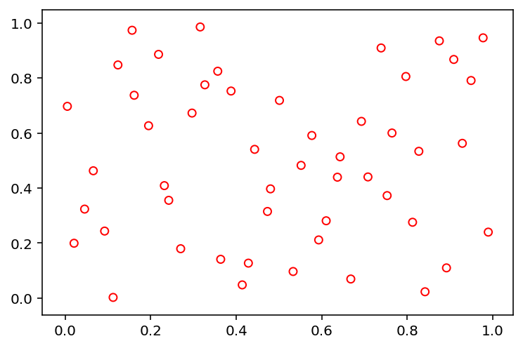
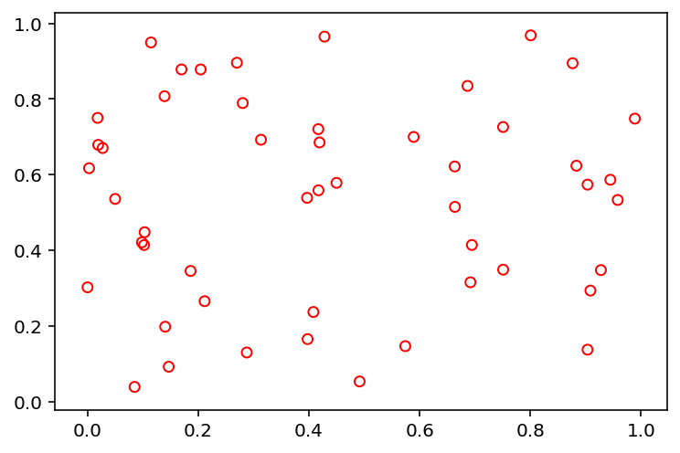
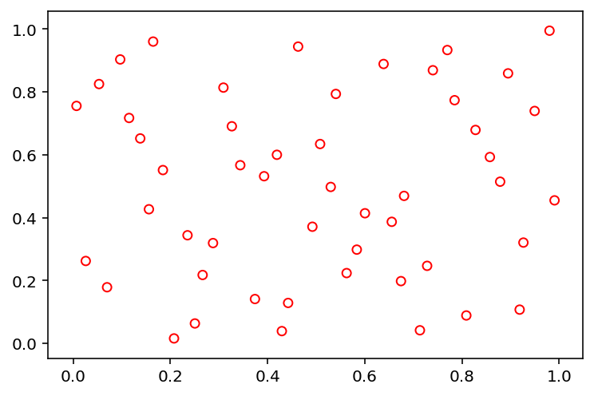
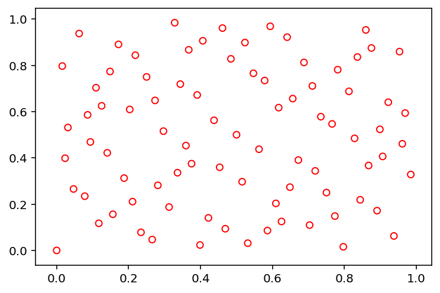
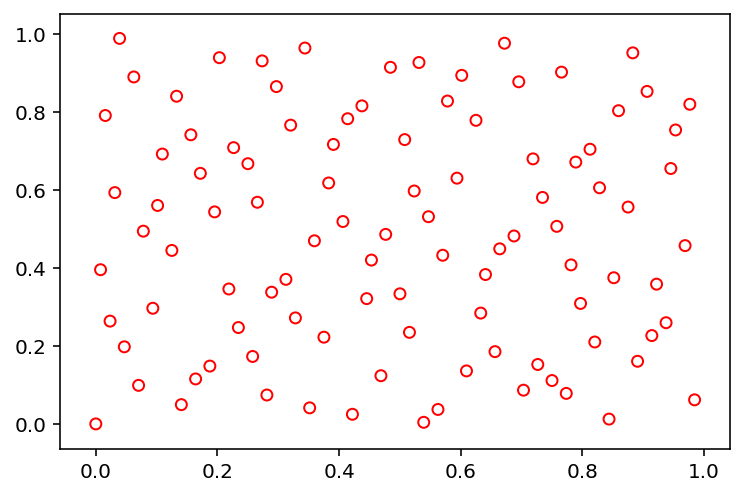

Installation
============

The framework is available at the PyPi Repository:

.. code-block:: bash

    pip install pysampling

Usage
=====

The method to be used for sampling using different algorithm must be
import from pysampling.sample. Here, we use Latin Hypercube Sampling to
generate 50 points in 2 dimensions.

.. code:: ipython3

    from pysampling.sample import sample
    
    X = sample("lhs", 50, 2)

Then, we recommend using matpotlib or other visualization libraries to
have a look at the results:

.. code:: ipython3

    import matplotlib.pyplot as plt
    
    plt.scatter(X[:, 0], X[:, 1], s=30, facecolors='none', edgecolors='r')
    plt.show()

Features
========

So far our library provides the following implementations:

-  Random (‘random’)
-  Latin Hypercube Sampling (‘lhs’)
-  Sobol (‘sobol’)
-  Halton (‘halton’)

The initialization of each of those will be shown in the following. Let
us first define a method that helps us to visualize them in a 2d space.

.. code:: ipython3

    import matplotlib.pyplot as plt
    
    def show(X):
        plt.scatter(X[:, 0], X[:, 1], s=30, facecolors='none', edgecolors='r')
        plt.show()

Random (‘random’)
-----------------

.. code:: ipython3

    X = sample("random", 50, 2, seed=1)
    show(X)

Latin Hypercube Sampling (‘lhs’)
--------------------------------

.. code:: ipython3

    X = sample("lhs", 50, 2, seed=1)
    show(X)

Sobol (‘sobol’)
---------------

.. code:: ipython3

    X = sample("sobol", 84, 2)
    show(X)

.. code:: ipython3

    X = sample("sobol", 84, 2, n_skip=100, n_leap=10)
    show(X)

.. image:: index_files/index_18_0.png
   :width: 372px
   :height: 248px

Halton (‘halton’)
-----------------

.. code:: ipython3

    X = sample("halton", 100, 2)
    show(X)

Contact
=======

.. |blankjul| raw:: html

   <a href="http://www.cse.msu.edu/~blankjul/" target="_blank">My personal homepage</a>

|blankjul|

Feel free to contact me if you have any question:

::

    Julian Blank (blankjul [at] egr.msu.edu)
    Michigan State University
    Computational Optimization and Innovation Laboratory (COIN)
    East Lansing, MI 48824, USA

